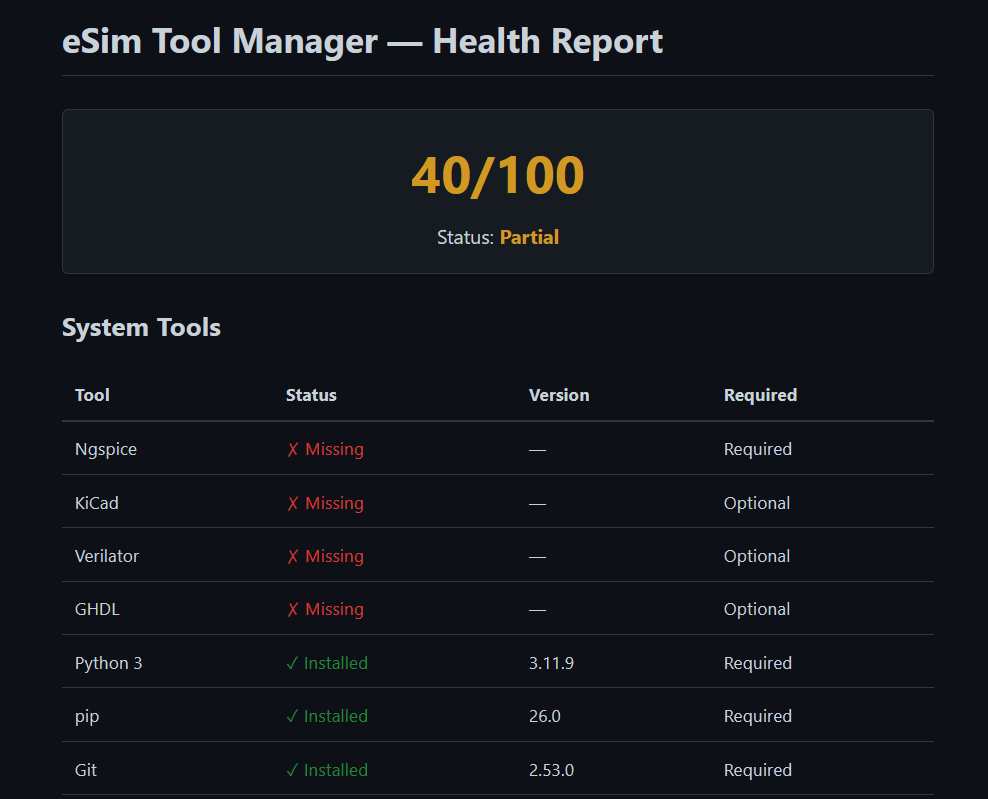
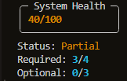
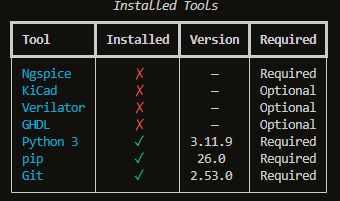

# eSim Tool Manager

A cross-platform CLI tool to manage, verify, and repair eSim dependencies with real-time health diagnostics.

## Features
- **Dependency checking** with automated version detection
- **Cross-platform installation** (apt, dnf, brew, winget)
- **Health scoring system** for system readiness
- **Automated repair** of missing required tools
- **HTML diagnostic report** for offline audits



## Visual Dashboard


## Installation

1. **Clone the repository**:
   ```bash
   git clone <repo-url>
   cd eSim-Tool-manager
   ```

2. **Create and activate a virtual environment**:
   ```bash
   python -m venv venv
   # Windows
   .\venv\Scripts\activate
   # Linux/macOS
   source venv/bin/activate
   ```

3. **Install dependencies**:
   ```bash
   pip install -r requirements.txt
   ```

## Usage

Run the manager using the `run.py` entry point:

```bash
# View all tools and their status
python run.py list

# Check tool dependencies
python run.py check

# View the system health dashboard
python run.py dashboard

# Scan and repair missing required tools
python run.py repair

# Generate an HTML health report
python run.py report
```

## Example Output



## Project Structure

- `src/registry.py`: Centralized tool definitions and version patterns.
- `src/platform_mgr.py`: OS-specific package manager abstraction layer.
- `src/checker.py`: Logic for installation detection and version extraction.
- `src/installer.py`: Subprocess-safe installation and update engine.
- `src/health.py`: Scoring algorithms for system readiness.
- `src/repair.py`: Automated dependency recovery logic.
- `src/report.py`: HTML generation engine.
- `src/cli.py`: User interface implementation and command routing.

## Design Highlights

- **Modular Architecture**: Decoupled modules ensure high maintainability and testability.
- **Zero Hardcoding**: All tool metadata is strictly managed via external `tools.toml`.
- **Cross-Platform Logic**: Abstracted package management handles system-specific complexities.
- **Error-Safe Execution**: Robust subprocess handling with timeouts and clean failure recovery.
