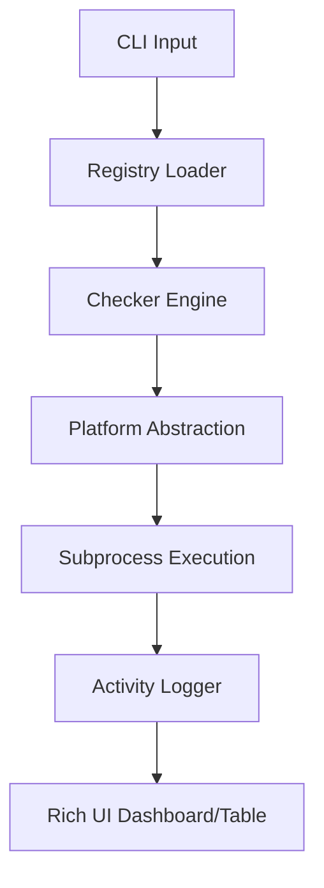
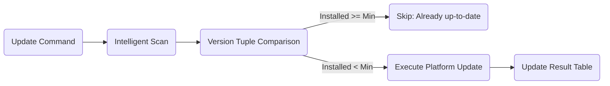

# eSim Tool Manager — Design Document

## 1. Overview

Managing dependencies for large EDA suites like eSim is often complex, platform-dependent, and error-prone. The **eSim Tool Manager** solves this by providing a modular, cross-platform CLI that automates verification, installation, and maintenance of electronic design tools.

### Goal
To ensure every eSim developer or user can initialize and maintain a compliant EDA toolchain with a single command.

---

## 2. Technical Architecture

The system is built on a modular decoupled architecture, ensuring each component serves a single, well-defined purpose.

| Module | Responsibility |
| :--- | :--- |
| **`registry`** | Centralized tool metadata management via `tools.toml`. |
| **`platform_mgr`** | OS-level abstraction mapping tools to `apt`, `dnf`, `brew`, or `winget`. |
| **`checker`** | Subprocess execution engine with regex-based version analysis. |
| **`installer`** | Safe tool installation and version-aware bulk updates. |
| **`config`** | Safe, persistent user system preferences (~/.esim_tool_manager/config.toml). |
| **`health`** | System readiness scoring (0-100) and threshold-based diagnostics. |
| **`repair`** | Automated logic for scanning and restoring missing dependencies. |
| **`report`** | Offline HTML diagnostic report generator with embedded styling. |
| **`cli`** | User interaction layer using `rich` for high-fidelity reporting. |
| **`logger`** | Activity auditing and command execution tracking. |

---

## 3. System Flow

The application follows a deterministic command-driven flow:

### **General Command Flow**

### **Intelligent Update Flow**

---

## 4. Key Design Decisions

- **TOML-Based Registry**: Tool definitions are kept outside the code, allowing updates to toolsets without logic changes.
- **Persistent User Configuration**: A safe `config.get()` mechanism uses split-key traversal to ensure no crashes during preference retrieval.
- **Deterministic Update Logic**: Avoids brittle string-parsing of subprocess output. Instead, it uses return codes for success/failure and pre-executes version comparison.
- **Tuple-Based Normalization**: Version strings like `3.11.9` are converted to `(3, 11, 9)` to enable reliable numeric comparison across multi-segment versions.
- **Cross-Platform Abstraction**: Centralizes package manager logic in `platform_mgr` to keep feature modules (like `installer`) platform-agnostic.

---

## 5. Intelligent Update Engine

The flagship feature of the eSim Tool Manager is its **version-aware** maintenance cycle.

### **Algorithm: parse_version**
1.  Extract numeric segments via regex: `re.findall(r'\d+', version_str)`.
2.  Convert segments to a tuple of integers.
3.  Handle malformed input by returning an empty tuple (Safe Default).

### **Algorithm: is_outdated**
1.  Generate tuples for both `installed_version` and `min_version`.
2.  If either tuple is empty, return `False` (Failure-Safe Skip).
3.  **Normalization**: Pad the shorter tuple with zeros (e.g., `(3, 8)` becomes `(3, 8, 0)` when compared to `(3, 8, 1)`).
4.  Perform a direct tuple comparison: `installed_norm < min_norm`.

---

## 6. Failure Handling Strategies

- **Command Discovery**: Uses `shutil.which` to identify if package managers exist before attempting execution.
- **Subprocess Isolation**: Commands run with `capture_output=True` and a default 10s timeout to prevent system-wide hangs.
- **Safe Keys**: All registry lookups for package names use `platform_mgr.pkg_key()` to prevent attribute errors on unsupported platforms.
- **Graceful Faults**: If a tool's version cannot be parsed, it is marked as "unknown" rather than raising an exception.

---

## 7. Requirement Mapping

| Requirement | Implementation Component |
| :--- | :--- |
| **Tool Installation** | `src/installer.py` + `src/platform_mgr.py` |
| **Dependency Checking** | `src/checker.py` + `tools.toml` |
| **Maintenance/Updates** | `src/installer.py` (Version-Aware Logic) |
| **User Preferences** | `src/config.py` (~/.esim_tool_manager/config.toml) |
| **UI/Reporting** | `src/cli.py` + `src/report.py` |

---

*This document is the master architectural record for the eSim Tool Manager project.*
