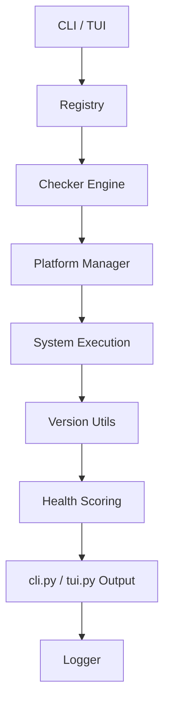

# Design Document: eSim Tool Manager (Final Specification)

## 1. Overview
The **eSim Tool Manager (esim-tm)** is a professional-grade CLI and TUI utility designed to manage, fix, and monitor toolchains for eSim environments. It automates the detection of missing EDA tools, manages complex system PATH configurations, and provides a centralized health dashboard for developers.

### Problem Solved
Manual setup of eSim tools (Ngspice, Verilator, GHDL, KiCad) is error-prone due to platform-specific PATH requirements, conflicting versions, and missing Python dependencies. `esim-tm` provides a "single-source-of-truth" diagnostic and repair engine.

### Core Requirements Implemented
1.  **Tool Discovery & Registry**: Dynamic loading of core and custom tools.
2.  **Platform-Aware Health Check**: Diagnostic engine for Windows/Linux/macOS.
3.  **Intelligent Versioning**: Semantic version normalization and "Outdated" detection.
4.  **Automated Repair & Assist**: Step-by-step assistance for system fixes.
5.  **System Snapshots**: Persistence and diffing of environmental states.
6.  **Real-time Dashboard**: Interactive TUI for monitoring tool health.

---

## 2. Technical Architecture

| Module | Responsibility |
| :--- | :--- |
| `src/cli.py` | Command dispatcher and parameter-driven entry point. |
| `src/tui.py` | Textual-based interactive dashboard and real-time monitoring. |
| `src/registry.py` | Centralized registry for core tools and safe custom tool merging. |
| `src/checker.py` | Diagnostic engine for executable detection and version extraction. |
| `src/installer.py` | Interface for system package managers (winget, pip, etc.). |
| `src/platform_mgr.py` | Normalizes OS-specific paths and detects system capabilities. |
| `src/health.py` | Algorithmic scoring engine for system readiness. |
| `src/repair.py` | Automated batch repair logic for environment issues. |
| `src/pip_checker.py` | Audits required Python packages vs installed environment. |
| `src/version_utils.py` | Semantic version parsing, normalization, and comparison logic. |
| `src/snapshot.py` | Logic for saving system state and performing differential analysis. |
| `src/report.py` | Generates comprehensive diagnostic summaries for exporting. |
| `src/logger.py` | Persistent event-driven logging with severity levels (`ERROR`, `WARNING`). |
| `src/config.py` | Environment configuration and global settings management. |

---

## 3. System Flow (Mermaid)

---

## 4. Intelligent Update Engine
The system utilizes a custom `version_utils` module to handle non-standard version strings returned by various EDA tools.

- **`parse_version()`**: Extracts numeric components from strings using regex filtering.
- **`tuple_normalization`**: Converts version strings (e.g., "1.2.3b") into comparable integer tuples `(1, 2, 3)`.
- **`is_outdated()`**: Performs a semver-aware comparison between the *installed* version and the *minimum required* version in the registry.

---

## 5. Assist State Machine
The `assist` command implements a robust state machine in `cli.py` to guide users through repairs.

- **States**: `installed`, `skipped`, `remaining`.
- **Loop Flow**: Iterates through detected issues, providing a dynamic menu per tool (Auto-install, Guided Download, Manual steps).
- **Re-check Logic**: Users can trigger an immediate re-scan after performing a fix to update the internal state machine.
- **Interrupt Safety**: Uses `finally` blocks to ensure a categorized summary is printed even if the process is terminated via `Ctrl+C`.

---

## 6. Doctor Command
The `doctor` command serves as the primary diagnostic tool, combining system executables and Python package audits.

1.  **Full Scan**: Calls `checker.check_all()` and `pip_checker.check_all()`.
2.  **Platform Awareness**: Fetches platform-specific "Fix Commands" via `get_fix_command()` (e.g., suggesting `winget` on Windows vs `apt` or manual links).
3.  **Unified Output**: Merges tool health, path diagnostics, and package readiness into a high-visibility terminal report.

---

## 7. Health Scoring
System health is quantified using a weighted algorithm in `health.py`.

### Scoring Formula
`Score = (RequiredToolsCount / TotalRequired * 70) + (OptionalToolsCount / TotalOptional * 30)`

### Status Thresholds
- **Excellent (>= 90)**: System is fully ready for eSim projects.
- **Good (70 - 89)**: All required tools are present; some optional features missing.
- **Partial (40 - 69)**: Critical required tools are missing.
- **Critical (< 40)**: Immediate attention required; toolchain is non-functional.

---

## 8. Registry Extension
The registry supports extension via a user-local `custom_tools.toml` file located in `~/.esim_tool_manager/`.

- **Safe Merge**: Custom tools are merged into the `registry_data` only after passing key-collision checks.
- **Validation**: Every custom entry must contain `name` and `check_cmd` fields.
- **Logged Rejection**: Invalid custom tool entries are recorded as `WARNING_INVALID` in the system log without interrupting the core process.

---

## 9. Requirement Mapping

| ID | Requirement | Modules |
| :--- | :--- | :--- |
| R1 | Tool Discovery & Registry | `registry.py`, `tools.toml` |
| R2 | Platform-Aware Health Check | `checker.py`, `platform_mgr.py` |
| R3 | Intelligent Versioning | `version_utils.py` |
| R4 | Automated Repair & Assist | `repair.py`, `installer.py`, `cli.py` |
| R5 | System Snapshots & Diffing | `snapshot.py` |
| R6 | Real-time Dashboard & Reporting | `tui.py`, `report.py`, `health.py` |

---

## 10. Failure Handling
The system is built on "Defensive Engineering" principles:

- **Subprocess Timeout**: Executable checks are capped at **30s** to prevent terminal hangs.
- **Safe Parsing**: TOML and JSON loaders use `try/except` blocks with meaningful logging.
- **Logger Fallback**: Standardizes all internal alerts in `esim_tm.log` with `ERROR` and `WARNING` severity.
- **Registry Validation**: Prevents ID conflicts from breaking core tool definitions.
- **Snapshot Error Handling**: Failures in saving or loading snapshots are logged as `ERROR` and caught gracefully to prevent CLI crashes.
