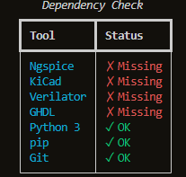

# eSim Tool Manager — Design Document

## 1. Overview
The **eSim Tool Manager** is a professional CLI utility designed to solve the complexity of managing external EDA tool dependencies (Ngspice, KiCad, Verilator, etc.) required by eSim. It provides a unified interface for installation, version detection, health monitoring, and automated repair across multiple operating systems.

## 2. Architecture

```text
+---------------------+
|        CLI          |  <-- Entry Point (run.py)
+---------+-----------+
          |
          v
+---------+-----------+      +-------------------+
|      Checker        | ---> |   Platform Mgr    |
+---------+-----------+      +---------+---------+
          |                           |
          v                           v
+---------+-----------+      +---------+---------+
|      Health         |      |    Subprocess     |  <-- OS Interactions
+---------+-----------+      +---------+---------+
          |                           |
          v                           v
+---------+-----------+      +---------+---------+
|      Report         |      |      Logger       |  <-- Persistence
+---------------------+      +-------------------+
```

### Execution Flow
`CLI` → `checker` → `platform_mgr` → `subprocess` → `logger` → `output`



### Core Modules
- **`registry`**: Acts as the single source of truth. It loads tool metadata, package names, and version regex patterns from `tools.toml`.
- **`platform_mgr`**: Abstract OS layer. It detects the host system and maps abstract install/update requests to native package managers (`apt`, `dnf`, `brew`, `winget`).
- **`checker`**: The detection engine. It executes check commands and parses output via regex to identify installation status and versions.
- **`installer`**: The execution engine. It handles the low-level subprocess calls to system package managers for installation and upgrades.

### Enhancement Modules
- **`health`**: Analyzes the results from the checker to compute a system readiness score (0-100) and status label (Excellent to Critical).
- **`repair`**: Orchestrates recovery. It scans for missing required tools and invokes the installer to restore them.
- **`report`**: The documentation engine. It generates standalone, dark-themed HTML health reports for offline audits.
- **`cli`**: The user interface. It handles argument parsing and provides a rich terminal experience with tables and dashboards.

## 3. Workflow

The operational flow follows a strict request-response pattern:

1. **User Input**: User executes a command via the CLI (e.g., `python run.py dashboard`).
2. **Registry Load**: The `cli` module calls `registry` to load the current tool definitions.
3. **Internal Logic**: The `cli` invokes the relevant module (`checker`, `health`, etc.) based on the command.
4. **Subprocess Execution**: Core modules interact with the target OS via `subprocess` with strict safety limits.
5. **Rich Output**: Results are processed and displayed back to the user via a formatted terminal interface.

## 4. Key Decisions

- **TOML-Based Registry**: Decoupling tool data from code allows for easy updates to tool versions or package names without modifying the core logic.
- **Subprocess Safety**: All shell commands are executed with `capture_output=True`, strict 10-second timeouts, and `returncode` validation to prevent hanging or silent failures.
- **Platform Abstraction**: By mapping abstract tool IDs to OS-specific package manager keys, the tool remains truly cross-platform while keeping the logic simple.
- **Failure-Safe Design**: Internal exception handlers ensure that missing commands or regex mismatches result in "unknown" or "missing" statuses rather than system crashes.

## 5. Features Implemented

| Requirement | Implementation |
| :--- | :--- |
| **Tool Installation** | Supported via `installer.py` using native package managers. |
| **Dependency Checking** | Real-time status and version detection in `checker.py`. |
| **Health Monitoring** | Scoring algorithm implemented in `health.py`. |
| **Auto-Repair** | Automated recovery system in `repair.py`. |
| **HTML Reporting** | Styled offline report generation in `report.py`. |
| **Cross-Platform** | Native support for Windows, Ubuntu/Fedora Linux, and macOS. |
| **CLI Dashboard** | High-level system overview via the `dashboard` command. |
