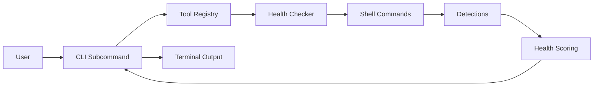

# Design Document - eSim Tool Manager

A technical specification of the eSim Tool Manager's architecture, design decisions, and system flow.

## System Flow
*How the tool processes environment data.*

---

## Design Decisions & Tradeoffs
*The rationale behind our architectural choices.*

### Snapshot System: Simplicity Over History
- **Choice**: Single-slot environment persistence.
- **Tradeoff**: We prioritize a fast "current vs. baseline" comparison instead of maintaining a complex versioned history.
- **Benefit**: Zero-maintenance state tracking with minimal disk overhead.

### PATH Detection: Safety Over Complexity
- **Choice**: Best-effort PATH verification via `shutil.which`.
- **Tradeoff**: We avoid deep, OS-level registry or environment variable manipulation.
- **Benefit**: Ensures the tool remains non-destructive and highly portable across Windows, Linux, and macOS.

### CLI-First Experience: Portability Over GUI
- **Choice**: High-quality Rich-formatted CLI.
- **Tradeoff**: We skip the overhead of a desktop GUI (e.g., Electron).
- **Benefit**: Enables remote usage via SSH and seamless integration into automation scripts.

---

## Failure Handling & Robustness
*Ensuring the tool remains reliable under stress.*

- **Subprocess Isolation**: All tool verification runs in isolated subprocesses with strict timeouts to prevent hanging.
- **Safe Persistence**: Snapshot JSON I/O is wrapped in `try/except` blocks to handle file corruption gracefully.
- **Output Integrity**: The CLI uses a global `--json` mode that suppresses all styling to ensure machine-readability.
- **Dry-Run Protection**: Repair operations support a `--dry-run` flag to preview changes before they're applied.
