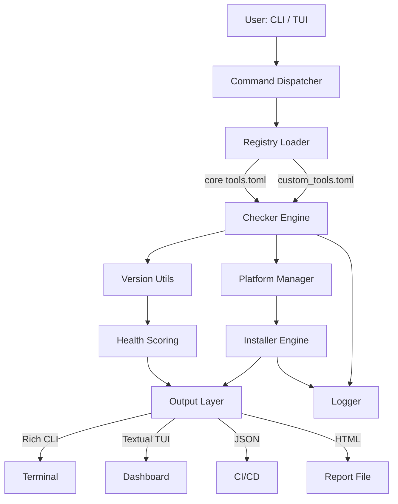
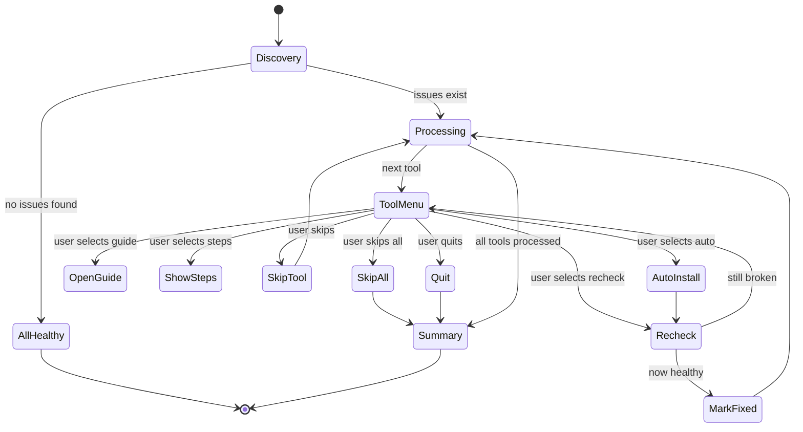

# Design Document — eSim Tool Manager

> **Version:** 1.1.0  
> **Status:** Final  
> **Related:** [README](README.md) · [Architecture](docs/ARCHITECTURE.md) · [Features](docs/FEATURES.md) · [Usage Workflows](docs/USAGE.md)

---

## Table of Contents

- [Design Document — eSim Tool Manager](#design-document--esim-tool-manager)
  - [Table of Contents](#table-of-contents)
  - [1. Problem Statement](#1-problem-statement)
  - [2. Design Goals](#2-design-goals)
  - [3. System Overview](#3-system-overview)
  - [4. Module Breakdown](#4-module-breakdown)
  - [5. Core Design Decisions](#5-core-design-decisions)
    - [5.1 Multi-Manager Strategy](#51-multi-manager-strategy)
    - [5.2 Search-Before-Install](#52-search-before-install)
    - [5.3 Structured Return Objects](#53-structured-return-objects)
    - [5.4 Zero Global State](#54-zero-global-state)
    - [5.5 Recovery-First Philosophy](#55-recovery-first-philosophy)
  - [6. Execution Pipeline](#6-execution-pipeline)
  - [7. Version Engine](#7-version-engine)
  - [8. Health Scoring Algorithm](#8-health-scoring-algorithm)
  - [9. Assist State Machine](#9-assist-state-machine)
  - [10. Failure Taxonomy](#10-failure-taxonomy)
  - [11. Registry Extension Model](#11-registry-extension-model)
  - [12. Requirement Coverage](#12-requirement-coverage)

---

## 1. Problem Statement

EDA environments like eSim depend on a chain of system tools — Ngspice for simulation, KiCad for PCB design, Verilator and GHDL for HDL simulation — plus a set of Python packages for the UI and data processing layer.

Setting these up manually creates three recurring failure modes:

1. **Silent breakage** — a system update removes or downgrades a tool without any visible error until a simulation is attempted.
2. **PATH misconfiguration** — tools install correctly but are unreachable because the binary directory is not in `$PATH` / `%PATH%`.
3. **Version drift** — a tool is present but at a version incompatible with eSim's requirements (e.g., Ngspice 36 vs minimum 37).

`esim-tm` is designed specifically to detect, explain, and fix all three failure modes across Linux, Windows, and macOS without requiring the user to understand the internals of any individual tool.

---

## 2. Design Goals

| Priority | Goal                                                                                                    |
| -------- | ------------------------------------------------------------------------------------------------------- |
| P0       | A single command (`doctor`) must give a complete, actionable picture of system health                   |
| P0       | No false positives — a tool must not be marked as installed if it cannot be reached from the terminal   |
| P1       | Repair must be non-destructive — failing to install something should never crash or corrupt the session |
| P1       | Cross-platform without conditional spaghetti — platform logic must be isolated behind a single module   |
| P2       | Extensible without touching core code — custom tools must be addable via a config file                  |
| P2       | Machine-readable output for CI/CD integration                                                           |

---

## 3. System Overview



---

## 4. Module Breakdown

| Module             | Responsibility                                                  | Key Functions                                               |
| ------------------ | --------------------------------------------------------------- | ----------------------------------------------------------- |
| `cli.py`           | Command dispatcher, argument parsing, user interaction          | `main()`, `cmd_doctor()`, `cmd_assist()`, `cmd_repair()`    |
| `tui.py`           | Textual TUI — 4 screens: Dashboard, Tools, Logs, Packages       | `ToolManagerApp`, `DashboardScreen`, `ToolsScreen`          |
| `registry.py`      | Loads `tools.toml`, merges `custom_tools.toml` safely           | `load()`                                                    |
| `checker.py`       | Subprocess-based tool detection, version extraction, PATH check | `check_tool()`, `check_all()`                               |
| `installer.py`     | Multi-manager install: search → validate → execute              | `install_tool()`, `update()`, `update_all()`                |
| `platform_mgr.py`  | OS detection, package manager discovery, command generation     | `get_available_managers()`, `install_cmd()`, `search_cmd()` |
| `health.py`        | Weighted scoring of system readiness                            | `compute()`                                                 |
| `repair.py`        | Batch repair orchestration for missing + conflicted tools       | `scan()`, `repair_all()`                                    |
| `pip_checker.py`   | Python package audit via `importlib.metadata`                   | `check_pkg()`, `check_all()`, `missing()`                   |
| `version_utils.py` | Non-standard version string normalization and comparison        | `parse_version()`, `is_outdated()`                          |
| `snapshot.py`      | JSON state persistence and differential comparison              | `save_snapshot()`, `load_snapshot()`, `get_diff()`          |
| `report.py`        | GitHub-dark themed HTML diagnostic report                       | `generate()`                                                |
| `logger.py`        | Timestamped append-only event log                               | `log()`, `read_last()`                                      |
| `config.py`        | User config (TOML) with safe defaults and dot-key access        | `get()`, `load()`, `save()`                                 |
| `constants.py`     | Centralized download and manual install URLs                    | `DOWNLOAD_LINKS`, `MANUAL_LINKS`                            |
| `tools.toml`       | Core tool registry — all required and optional EDA tools        | Static data                                                 |

---

## 5. Core Design Decisions

### 5.1 Multi-Manager Strategy

Rather than assuming a single package manager (`apt` or `winget`), the platform module detects _all_ available managers at runtime and returns them in priority order. The installer iterates through the list until one succeeds.

This means the tool works on Ubuntu (apt), Fedora (dnf), macOS (brew), Windows with winget, and Windows with Chocolatey — without the user configuring anything.

### 5.2 Search-Before-Install

Installing a package that doesn't exist in the repository produces noisy errors and leaves the system in an inconsistent state. Before any install attempt, the installer runs a package search and validates the result using deterministic word-boundary matching.

```
pkg = "ngspice"
line = "ngspice/jammy 37+dfsg-2 amd64"

→ Exact match:        False
→ Prefix match:       True  (line starts with "ngspice/")
→ Word boundary:      True  (split on "/" → ["ngspice", "jammy ..."])
```

This prevents `libngspice` or `ngspice-dev` from being treated as a valid match for `ngspice`.

### 5.3 Structured Return Objects

Every function in the diagnosis and repair pipeline returns a structured dictionary, not a boolean or raw string. This makes the output predictable for every consumer — CLI, TUI, JSON mode, and tests.

```python
# Every checker result has these keys
{
    "id": "ngspice",
    "name": "Ngspice",
    "installed": False,
    "path_issue": False,
    "version": None,
    "required": True,
    "min_version": "37",
    "conflict": False
}
```

### 5.4 Zero Global State

No module stores state in module-level variables. Everything flows through function parameters and return values. This makes testing straightforward — any function can be called in isolation with a mock registry or result set.

### 5.5 Recovery-First Philosophy

The `assist` command is deliberately interactive. Fully automated batch repair (`repair`) is also available, but the primary repair path asks the user before acting, shows what it's about to do, and re-checks after each action. This keeps the user in control of changes to their system.

---

## 6. Execution Pipeline

```
esim-tm doctor
     │
     ▼
check_first_run()          — show onboarding once if flag not present
     │
     ▼
argparse dispatch          — route to cmd_doctor(args)
     │
     ▼
registry.load()            — merge tools.toml + custom_tools.toml
     │
     ▼
checker.check_all()        — subprocess each check_cmd with timeout=30s
     │                        extract version via regex pattern
     │                        check shutil.which() for PATH presence
     ▼
version_utils.is_outdated()  — parse both versions to int tuples
     │                         compare element-by-element
     ▼
pip_checker.check_all()    — importlib.metadata.version() per package
     │
     ▼
health.compute()           — weighted score calculation
     │
     ▼
Rich output                — colour-coded per-tool status + fix commands
                             bulk fix command for multiple missing packages
```

---

## 7. Version Engine

EDA tools do not follow consistent versioning. Examples from real output:

```
ngspice --version   →  "ngspice-42 : Circuit level simulation program"
ghdl --version      →  "GHDL 4.1.0-dev (v4.1.0-rc1) [Dunoon edition]"
kicad --version     →  "8.0.3"
verilator --version →  "Verilator 5.026 2024-01-01 rev v5.026"
git --version       →  "git version 2.42.0"
```

The `version_utils` module normalises all of these using a two-step process:

**Step 1 — Pattern extraction (per tool in registry):**

```toml
# tools.toml
[ngspice]
version_pattern = "ngspice-(\\d+)"
```

**Step 2 — Tuple normalization:**

```python
def parse_version(v_str):
    nums = re.findall(r'\d+', str(v_str))
    return tuple(int(n) for n in nums)

# "42"      → (42,)
# "4.1.0"   → (4, 1, 0)
# "5.026"   → (5, 26)
```

**Step 3 — Comparison:**

```python
def is_outdated(installed_v, min_v):
    v1 = parse_version(installed_v)
    v2 = parse_version(min_v)
    # Pad shorter tuple with zeros
    max_len = max(len(v1), len(v2))
    v1 = v1 + (0,) * (max_len - len(v1))
    v2 = v2 + (0,) * (max_len - len(v2))
    return v1 < v2
```

This handles all real-world EDA version formats without fragile string comparison.

---

## 8. Health Scoring Algorithm

```
Score = (required_installed / required_total × 70)
      + (optional_installed / optional_total × 30)
```

Where:

- A tool counts as installed only if: `installed == True AND conflict == False AND path_issue == False`
- `required_total` and `optional_total` are derived from the registry at runtime
- Score is clamped to `[0, 100]`

| Range | Status    | Interpretation                                |
| ----- | --------- | --------------------------------------------- |
| 100   | Excellent | Everything present and current                |
| 70–99 | Good      | Required tools healthy, some optional missing |
| 40–69 | Partial   | One or more required tools missing            |
| 0–39  | Critical  | Core toolchain is non-functional              |

If there are no optional tools registered, the optional component contributes its full 30 points. Same for required. This prevents division-by-zero on minimal registries.

---

## 9. Assist State Machine

The `assist` command is implemented as a two-level loop with guaranteed termination.



**State guarantees:**

- `installed`, `skipped`, and `remaining` sets are always disjoint
- A tool can only transition to `installed` if a live re-check confirms it
- `finally` block runs regardless of how the session ends (normal exit, skip-all, Ctrl+C), ensuring the summary always prints

---

## 10. Failure Taxonomy

The installer classifies every failed attempt with a typed reason code, which drives the UX in `assist`:

| Code                   | Meaning                                                 | UX Response                               |
| ---------------------- | ------------------------------------------------------- | ----------------------------------------- |
| `no_package_manager`   | No supported manager found on the host                  | Show manual install steps                 |
| `not_found_in_manager` | Search phase found no match in any manager              | Show manual install steps + download link |
| `install_failed`       | Package found, install command ran but returned failure | Show error + manual fallback              |
| `unsupported_platform` | Tool has no package entry for this OS                   | Show download link only                   |

This avoids the failure mode of showing an auto-install button when auto-install cannot possibly work.

---

## 11. Registry Extension Model

The registry supports user-defined tools via `~/.esim_tool_manager/custom_tools.toml`:

```toml
[openroad]
name        = "OpenROAD"
check_cmd   = "openroad -version"
required    = false
min_version = "2.0"
apt_pkg     = "openroad"
```

Merge rules:

1. If the key already exists in core registry → skip with `WARNING_CONFLICT` log
2. If `name` or `check_cmd` is missing → skip with `WARNING_INVALID` log
3. If `required` is absent → defaults to `false`
4. Passed entries are inserted into the live registry dict for the current session only

Invalid entries are logged and skipped silently. The core tool list is never modified.

---

## 12. Requirement Coverage

| Requirement            | Implementation                                              | Module(s)                         |
| ---------------------- | ----------------------------------------------------------- | --------------------------------- |
| Tool installation      | Multi-manager adaptive installer with search validation     | `installer.py`, `platform_mgr.py` |
| Version management     | Regex extraction + tuple-based semver comparison            | `version_utils.py`, `checker.py`  |
| Update and upgrade     | `update` / `update_all` with outdated detection             | `installer.py`, `cli.py`          |
| Configuration handling | TOML config with dot-key access and auto-defaults           | `config.py`                       |
| PATH management        | `shutil.which()` check per tool, separate `path_issue` flag | `checker.py`                      |
| Dependency checking    | System tools + Python packages audited together             | `checker.py`, `pip_checker.py`    |
| User interface         | CLI (Rich), TUI (Textual), JSON, HTML report                | `cli.py`, `tui.py`, `report.py`   |
| Action logging         | Timestamped append-only log with severity                   | `logger.py`                       |
| Cross-platform         | Linux (apt/dnf), Windows (winget/choco), macOS (brew)       | `platform_mgr.py`                 |
| Environment snapshots  | JSON state capture + differential comparison                | `snapshot.py`                     |
| Extensibility          | Custom tool registry via TOML                               | `registry.py`, `tools.toml`       |
| CI/CD integration      | `--json` flag on all diagnostic commands + exit codes       | `cli.py`                          |
