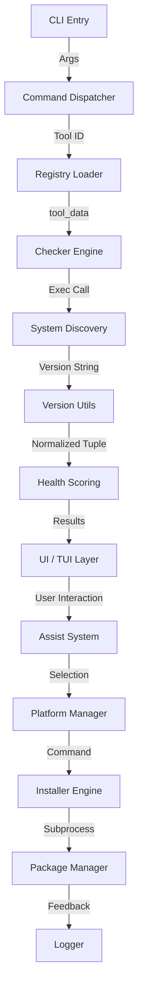

# eSim-tm Architecture Overview

This document describes the internal structure and logic of the eSim Tool Manager (`esim-tm`).

---

### **1. Component Interaction (Mermaid)**

---

### **2. Execution Flow (Step-by-Step)**

1.  **Parsing**: The `CLI` (Argparse) parses the user command and global flags (e.g., `--verbose`, `--json`).
2.  **Registry Loading**: `Registry` merges `tools.toml` and any local user extensions, ensuring no key collisions.
3.  **Discovery**: `Checker` executes platform-specific version/check commands for each tool in the registry.
4.  **Normalization**: Version strings are processed by `Version Utils` using regex-based extraction and tuple-based normalization.
5.  **Diagnostic Audit**: Tool state is combined with a `Pip Audit` to identify missing Python dependencies.
6.  **Instruction Generation**: `Platform Manager` determines the best manager command (e.g., `winget`, `choco`, `brew`) based on system detection.
7.  **Execution**: The `Installer` executes repairs with strict success normalization (exit codes + log scanning).
8.  **Output**: Results are rendered via `Rich` (CLI), `Textual` (TUI), or `Jinja2` (HTML Report).

---

### **3. Engineering Deep Dive: Version Engine**

The `version_utils` logic is the highest-confidence part of the architecture, handling the inconsistent version strings produced by EDA tools:

-   **Regex Extraction**: Isolates core version numbers from noisy strings (e.g., `ngspice-42` → `42`).
-   **Tuple-Based Comparison**: Converts "1.2.3b" into `(1, 2, 3)` integer tuples. This allows a robust semantic comparison (`v_installed < v_minimum`) that is far more reliable than string comparison.
-   **Outdated Flag**: Automatically sets a "Conflict/Outdated" flag if a tool is healthy but fails the version audit for eSim compatibility.

---

### **2. Core Modules**

-   **CLI (src/cli.py)**: The entry point. Handles argument parsing, user interaction, and high-level command logic.
-   **Registry (src/tools.toml)**: The static configuration for all eSim-related tools (name, version, packages, links).
-   **Checker (src/checker.py)**: The diagnostic heart. Runs platform-specific commands to verify a tool's existence and health.
-   **Installer (src/installer.py)**: A safe wrapper for system-level package managers (WinGet, APT, Brew) with built-in timeouts.
-   **Snapshot (src/snapshot.py)**: State-tracking logic for environment captures and diffing.

---

### **3. The Assist System (State Machine)**

The `esim-tm assist` command is built around a robust state machine that guarantees a non-dead-end UX:

1.  **Discovery Phase**: Scans the system using `checker.check_all()`.
2.  **Partitioning**: Divides tools into `Installed`, `Skipped`, and `Remaining` sets.
3.  **Iteration Loop**:
    -   Picks a `Remaining` tool.
    -   Displays a dynamic menu based on tool metadata (Auto-install, manual guide, steps).
    -   Executes user choice and **re-checks automatically** using `checker.check_tool()`.
4.  **Final Summary**: Generates a product-grade categorization report once all tools are addressed.

---

### **4. Error Handling & Stability**

-   **Subprocess Protection**: All system calls use `subprocess.run` with explicit `timeout=30` and `try-except` blocks.
-   **Safe State Tracking**: Tools are only marked as "Installed" if a fresh diagnostic check passes, ensuring that temporary installation success doesn't hide a permanent tool failure.
