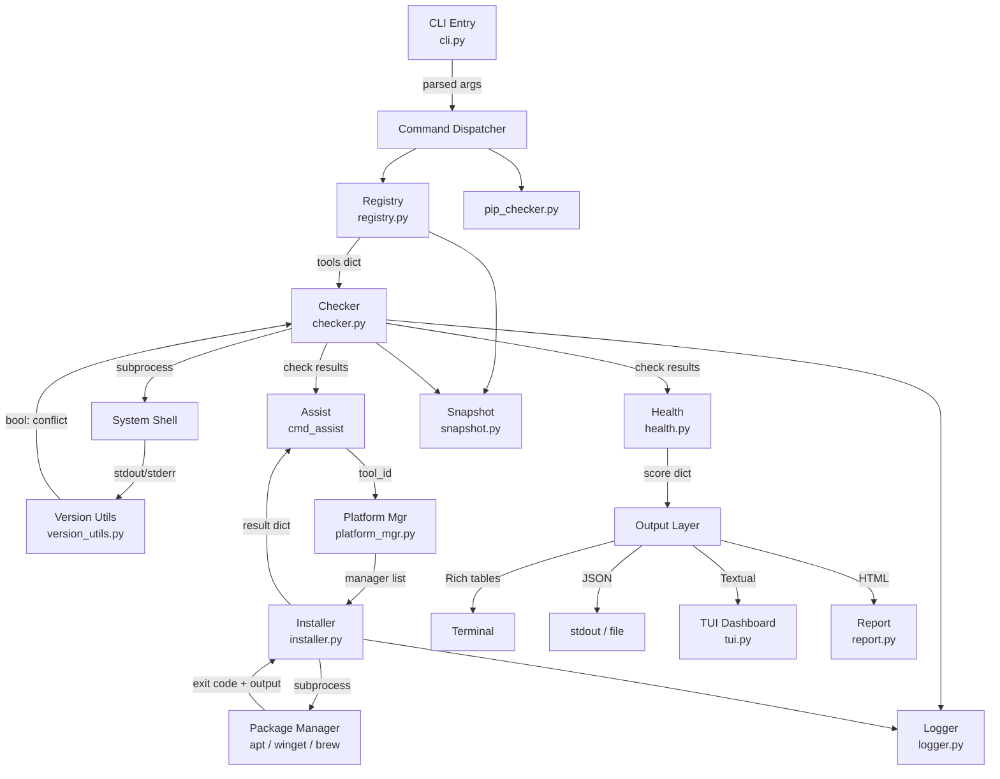

# Architecture — eSim Tool Manager

> **Related:** [README](../README.md) · [Design Document](../design_document.md) · [Features](FEATURES.md) · [Usage](USAGE.md)

---

## Table of Contents

- [Architecture — eSim Tool Manager](#architecture--esim-tool-manager)
  - [Table of Contents](#table-of-contents)
  - [1. Component Map](#1-component-map)
  - [2. Execution Flow](#2-execution-flow)
  - [3. Module Internals](#3-module-internals)
    - [3.1 Registry](#31-registry)
    - [3.2 Checker Engine](#32-checker-engine)
    - [3.3 Version Utils](#33-version-utils)
    - [3.4 Platform Manager](#34-platform-manager)
    - [3.5 Installer Engine](#35-installer-engine)
    - [3.6 Health Scoring](#36-health-scoring)
    - [3.7 Snapshot System](#37-snapshot-system)
    - [3.8 Assist State Machine](#38-assist-state-machine)
  - [4. Data Structures](#4-data-structures)
  - [5. Error Handling Strategy](#5-error-handling-strategy)
  - [6. TUI Architecture](#6-tui-architecture)

---

## 1. Component Map



---

## 2. Execution Flow

Step-by-step breakdown of what happens when you run any command:

```
1. main()
   └─ check_first_run()          Show welcome message once (flag file)
   └─ argparse.parse_args()      Route to the correct cmd_* function

2. cmd_doctor(args)   [example]
   └─ registry.load()
      ├─ importlib.resources → tools.toml (bundled)
      └─ Path.home()/.esim_tool_manager/custom_tools.toml (optional)
         └─ validate keys → safe merge

   └─ checker.check_all(registry_data)
      └─ per tool:
         ├─ subprocess.run(check_cmd, timeout=30, shell=True)
         ├─ regex match → version string
         ├─ shutil.which(base_cmd) → path_issue bool
         └─ version_utils.is_outdated(version, min_version) → conflict bool

   └─ pip_checker.check_all()
      └─ per package:
         └─ importlib.metadata.version(name) → installed + version
            └─ is_outdated(version, min_ver) → ok bool

   └─ health.compute(tool_results)
      └─ weighted score + status thresholds

   └─ Rich terminal output
      └─ per tool: ✓/✗/⚠ + fix command (platform-aware)
      └─ bulk pip fix command if multiple packages missing
      └─ readiness score line
```

---

## 3. Module Internals

### 3.1 Registry

`registry.py` is intentionally thin. Its only job is to return a `dict[str, dict]` mapping tool IDs to their configuration.

```
registry.load()
    │
    ├─ Load bundled tools.toml via importlib.resources
    │   (works after pipx install, no path assumptions)
    │
    └─ If custom_tools.toml exists at ~/.esim_tool_manager/:
        ├─ Parse TOML safely
        ├─ For each entry:
        │   ├─ Skip if key already in registry → log WARNING_CONFLICT
        │   ├─ Skip if "name" or "check_cmd" missing → log WARNING_INVALID
        │   └─ Set required=False if absent → insert
        └─ Return merged dict
```

Invalid entries never raise exceptions. They are logged and skipped, preserving normal operation.

---

### 3.2 Checker Engine

`checker.py` runs the actual system probe for each tool.

```python
check_tool(tool_id, tool_data) → dict
```

```
1. subprocess.run(check_cmd, shell=True, timeout=30)
   → returncode == 0 means installed

2. Regex match on stdout + stderr combined
   → version_pattern from registry
   → None if pattern absent or unmatched → "unknown"

3. shutil.which(base_cmd)
   → base_cmd = first token of check_cmd
   → path_issue = installed but not in PATH

4. is_outdated(version, min_version)
   → conflict = True if version < min_version

5. Return structured dict
   {id, name, installed, path_issue, version, required, min_version, conflict}
```

**Why `shell=True`?**  
Some tools (especially on Windows) are accessible only through the shell's PATH resolution, not as direct executables. Using `shell=True` mirrors how a real user would invoke the command.

**Timeout = 30s:**  
Some GUI tools (KiCad) have slow cold starts. 10s caused false negatives. 30s is the documented and implemented value in the codebase.

---

### 3.3 Version Utils

The version engine exists because EDA tools do not use consistent versioning. It works in two steps:

**Parse:**

```python
parse_version("ngspice-42")  → (42,)
parse_version("4.1.0-dev")   → (4, 1, 0)
parse_version("5.026")       → (5, 26)
```

`re.findall(r'\d+', v_str)` extracts all numeric components and discards all non-numeric noise.

**Compare:**

```python
is_outdated("3.9.1", "3.11.0")
  → (3,9,1) vs (3,11,0)
  → pad to equal length: (3,9,1) < (3,11,0)
  → True (installed is older)
```

Tuple padding with zeros handles version strings of different depths:

```
"42" vs "37"   → (42,0) vs (37,0) → not outdated
"2.0" vs "10"  → (2,0) vs (10,0)  → outdated
```

Edge case: empty or unparseable version strings return `()`, and `is_outdated` returns `False` (assume OK if we can't tell).

---

### 3.4 Platform Manager

`platform_mgr.py` isolates all OS-specific logic behind a clean interface. No other module performs OS detection.

```
get_available_managers()
  linux  → check shutil.which("apt-get") → "apt"
           check shutil.which("dnf")     → "dnf"
  macos  → check shutil.which("brew")    → "brew"
  windows→ check shutil.which("winget")  → "winget"
           check shutil.which("choco")   → "choco"

install_cmd(pkg, manager)
  apt    → ["sudo", "apt-get", "install", "-y", pkg]
  dnf    → ["sudo", "dnf", "install", "-y", pkg]
  brew   → ["brew", "install", pkg]
  winget → ["winget", "install", "--id", pkg, "-e", "--silent"]
  choco  → ["choco", "install", "-y", pkg]
```

All functions accept an explicit `manager` parameter. This means the installer can iterate through a list of managers without re-detecting the OS for each iteration.

---

### 3.5 Installer Engine

`installer.py` implements a three-phase install protocol:

```
Phase 1: Manager Discovery
  platform_mgr.get_available_managers()
  → empty list: return {success: False, reason: "no_package_manager"}

Phase 2: Search Validation (per manager)
  pm.search_cmd(manager, pkg)
  subprocess.run(search_cmd, timeout=10)
  _is_pkg_match(output, pkg)
  → no match: try next manager
  → match: proceed to phase 3

Phase 3: Install
  pm.install_cmd(pkg, manager)
  subprocess.run(install_cmd, timeout=300)
  check returncode AND scan output for error keywords
  → success: return {success: True, manager: manager}
  → failure: log + try next manager
```

**`_is_pkg_match` logic:**

```
pkg = "ngspice"
Per line in search output (lowercased):
  1. line == pkg              → exact match
  2. line starts with pkg+separator → prefix match (handles "ngspice/jammy 37")
  3. split line on "/" "-" "." → word list → pkg in words
```

This prevents accepting `libngspice` or `ngspice-dev` as a valid hit for `ngspice`.

---

### 3.6 Health Scoring

```python
req_ok  = count(r for r in required  if installed and not conflict and not path_issue)
opt_ok  = count(r for r in optional  if installed and not path_issue)

score   = (req_ok / req_total * 70) + (opt_ok / opt_total * 30)
score   = clamp(round(score), 0, 100)
```

PATH issues count as failures because a tool that cannot be reached from the terminal is functionally absent, even if it is physically installed.

---

### 3.7 Snapshot System

Snapshots capture the full tool + package state to a JSON file at `~/.esim_tool_manager/snapshot.json`.

```json
{
  "timestamp": "2026-04-10T14:23:01.452312",
  "tools": [ ... checker.check_all() output ... ],
  "packages": [ ... pip_checker.check_all() output ... ]
}
```

`get_diff(old, current_tools, current_pkgs)` compares by tool name:

```
For each tool name present in both old and new:
  old_issue = not installed OR conflict
  new_issue = not installed OR conflict

  old_ok and now_problem → "new_issues"
  old_problem and now_ok → "fixed_issues"
```

This surfaces regressions caused by system updates without requiring the user to remember what was working before.

---

### 3.8 Assist State Machine

```
initial_tools = {all tool IDs with issues} (locked at session start)
installed_tools = {}
skipped_tools  = {}

outer loop: for tool_id in sorted(initial_tools):
  if already in installed or skipped: continue
  check tool live
  if now healthy: mark installed, continue

  inner loop: show menu, handle choice
    auto-install → run installer → prompt recheck → mark installed or stay
    open guide   → webbrowser.open(url)
    show steps   → print INSTALL_STEPS[tool_id]
    recheck      → check live → mark installed or increment counter
    skip         → mark skipped, break inner
    skip all     → mark all remaining as skipped, return (triggers finally)
    quit         → return (triggers finally)

finally block (always runs):
  remaining = initial_tools - installed - skipped
  print categorized summary: Fixed / Skipped / Remaining
```

The `finally` block runs on normal exit, `return`, and `KeyboardInterrupt`. The summary is always printed.

---

## 4. Data Structures

**Tool check result** (from `checker.check_tool`):

```python
{
    "id":          str,    # registry key, e.g. "ngspice"
    "name":        str,    # display name, e.g. "Ngspice"
    "installed":   bool,   # subprocess returned exit code 0
    "path_issue":  bool,   # installed but shutil.which fails
    "version":     str,    # extracted version string or "unknown"
    "required":    bool,   # from registry
    "min_version": str,    # from registry
    "conflict":    bool,   # installed version < min_version
}
```

**Package check result** (from `pip_checker.check_pkg`):

```python
{
    "name":      str,   # e.g. "numpy"
    "installed": bool,
    "version":   str,   # e.g. "1.26.4" or None
    "ok":        bool,  # installed and version >= minimum
}
```

**Health result** (from `health.compute`):

```python
{
    "score":              int,    # 0–100
    "status":             str,    # "Excellent" | "Good" | "Partial" | "Critical"
    "required_installed": int,
    "required_total":     int,
    "optional_installed": int,
    "optional_total":     int,
    "conflicts":          list,   # tool dicts where conflict == True
}
```

**Installer result** (from `installer.install_tool`):

```python
{
    "success": bool,
    "reason":  str,   # None | "no_package_manager" | "not_found_in_manager" | "install_failed"
    "manager": str,   # e.g. "apt" or None
    "manual":  str,   # fallback download URL
}
```

---

## 5. Error Handling Strategy

| Layer                     | Strategy                                                                                                                         |
| ------------------------- | -------------------------------------------------------------------------------------------------------------------------------- |
| Subprocess calls          | `try/except Exception` + `timeout=` on every call. Failures return `installed=False`, not exceptions.                            |
| TOML parsing              | `try/except` wrapping both `tools.toml` and `custom_tools.toml`. Parse errors are logged; custom tools are skipped silently.     |
| Version parsing           | `re.findall` on any string input. Empty or malformed strings return `()` tuple; `is_outdated` returns `False` as a safe default. |
| Installer search timeout  | `subprocess.TimeoutExpired` caught per manager; try next manager.                                                                |
| Installer install timeout | 300s limit. `TimeoutExpired` caught; log + continue to next manager.                                                             |
| Assist keyboard interrupt | Outer `try/except KeyboardInterrupt` + `finally` block ensures summary always prints.                                            |
| Registry custom merge     | Per-entry validation. Bad entries skip silently with log. Core registry never modified.                                          |
| Snapshot load             | `try/except` on JSON parse. Returns `None` on failure; caller handles missing snapshot gracefully.                               |

---

## 6. TUI Architecture

The TUI is built on [Textual](https://textual.textualize.io/) and consists of four screens:

```
ToolManagerApp (App)
├─ DashboardScreen   — health score, required/optional counts, key hints
├─ ToolsScreen       — DataTable: all tools sorted required-first
├─ PackagesScreen    — DataTable: all Python packages sorted ok-first
└─ LogsScreen        — last 10 log entries as Static widget

Bindings:
  1 → DashboardScreen
  2 → ToolsScreen
  3 → LogsScreen
  4 → PackagesScreen
  q → quit
```

`DashboardScreen.compose()` runs `checker.check_all()` synchronously during initial load. `ToolsScreen.on_mount()` and `PackagesScreen.on_mount()` populate their DataTables after the screen renders, preventing a blank flash.

The TUI reads live data on every screen mount — switching screens triggers a fresh scan.
